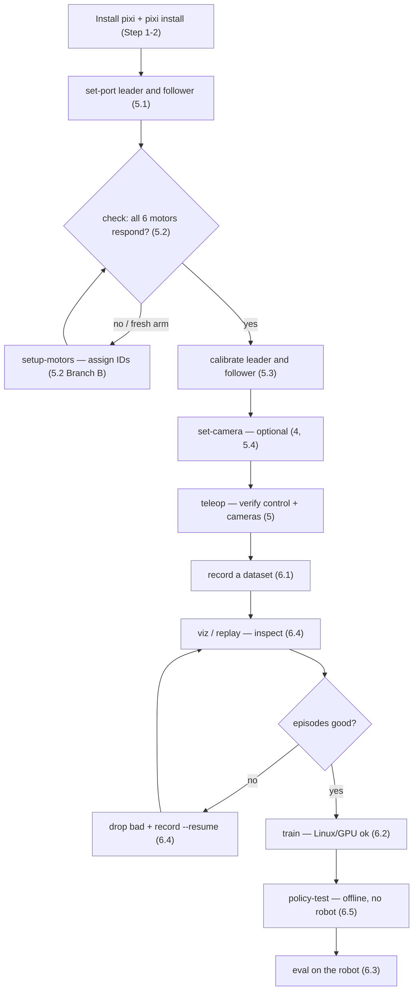

# lecture_lerobot_teleop

A reproducible [LeRobot](https://github.com/huggingface/lerobot) teleoperation
environment for the lecture, managed with [pixi](https://pixi.sh).

`pixi` resolves **conda-forge** and **PyPI** packages into a single lockfile, so
everyone gets an identical environment on macOS and Linux with one command. We
use it here to combine the native **ffmpeg** build (from conda-forge) that
LeRobot needs for video encode/decode with **`lerobot[feetech]`** (from PyPI),
which adds the Feetech servo SDK used to drive SO-100 / SO-101 teleop arms.

🇯🇵 日本語版は [README_ja.md](./README_ja.md) を参照してください。

## Overview — what runs in what order



First time? Do **Steps 1–3 once**, then the hardware bring-up (Step 5) per arm,
then loop the data→train→eval cycle (Step 6). Blue boxes need **no robot** (can
run on a remote/Linux GPU box).

### What to connect, and when

| Command | Plug in | Notes |
| --- | --- | --- |
| `set-port leader` / `follower` | that **one** arm's USB | you'll be asked to *unplug* it to detect the port — connect one at a time |
| `setup-motors <role>` | the arm's controller + **motor power**, then motors **one at a time** | follow the prompts |
| `check` / `calibrate <role>` | that arm's USB **+ motor power** | |
| `teleop`, `record` | **both** arms' USB + **both powered** + cameras' USB | leader=teleop, follower=robot |
| `eval`, `replay` | **follower** USB + power (+ cameras for eval) | no leader — the policy/recording drives the follower |
| `find-cameras`, `set-camera` | the cameras' USB | get the index, then register it |
| `train`, `policy-test`, `viz`, `upload` | **nothing** (no robot) | data/compute only — fine over SSH |

> Power = the servo bus power (DC barrel jack), separate from USB. Motors won't
> respond on USB alone. For autonomous `eval`, keep the power switch / E-stop
> within reach (see [Safety](#safety-gentle-motion--stopping)).

## What's included

| Package | Version | Source | Why |
| --- | --- | --- | --- |
| `python` | `3.10.*` | conda-forge | Matches the upstream guidance for lerobot 0.3.3 |
| `ffmpeg` | `>=7.0,<8` | conda-forge | Video encode/decode; lerobot's decoder (`torchcodec`) supports ffmpeg ≤ 7 |
| `lerobot[feetech,pi0]` | `==0.3.3` | PyPI | LeRobot + Feetech motors + PI0 policy dependencies |

The pins are explained under [Why these versions?](#why-these-versions) below.

## 1. Install pixi (once per machine)

```bash
curl -fsSL https://pixi.sh/install.sh | bash
```

Then restart your shell (or `source` your shell rc) so `pixi` is on your `PATH`.
On Windows, see the [official install guide](https://pixi.sh/latest/#installation).

> Already have pixi? Make sure it is reasonably recent: `pixi --version`
> (developed with pixi 0.61).

### Linux requirement

The Linux build needs **glibc ≥ 2.31** (Ubuntu 20.04+, Debian 11+). This is
because LeRobot pulls in `rerun-sdk`, whose wheels target `manylinux_2_31`.
macOS (Apple Silicon) has no such constraint.

## 2. Set up the environment

From the repository root:

```bash
pixi install
```

This reads `pixi.toml`, solves all dependencies, writes/updates `pixi.lock`, and
installs everything into a local `.pixi/` folder. The first run downloads
PyTorch and friends, so it can take a few minutes.

## 3. Use the environment

Run a single command inside the environment:

```bash
pixi run python -c "import lerobot; print(lerobot.__version__)"
```

Or drop into an activated shell:

```bash
pixi shell
python -c "import lerobot; print(lerobot.__version__)"
exit   # leave the pixi shell
```

### Predefined tasks

```bash
pixi run verify          # import lerobot + feetech SDK and print the version
pixi run ffmpeg-version  # print the ffmpeg version pixi installed
pixi run find-cameras    # list connected cameras and save a sample image

# SO-101 arm workflow — register each arm once, then no ports/ids to type:
pixi run set-port leader      # detect & save the leader's serial port (and id)
pixi run set-port follower    # same for the follower
pixi run arms                 # show the registered arms
pixi run check follower       # per-motor diagnostic on the saved port
pixi run setup-motors leader  # assign motor IDs using the saved port
pixi run set-camera front --index 0  # attach a camera to the follower (see Step 5.4)
pixi run calibrate leader     # calibrate using the saved port/id
pixi run teleop               # teleoperate (+ cameras in a viewer) — no args!

# Imitation-learning pipeline (see Step 6):
pixi run record --task "Grab the cube" --repo-id record-test --episodes 5
pixi run replay --repo-id record-test --episode 0   # play a recording back on the follower
pixi run viz    --repo-id record-test --episode 0   # visualize an episode in a Rerun viewer
pixi run upload --repo-id record-test               # push the local dataset to the Hub
pixi run train  --repo-id record-test
pixi run eval   --policy outputs/train/act_record-test/checkpoints/last/pretrained_model \
                --task "Grab the cube" --repo-id eval_record-test
```

## 4. Check connected cameras

LeRobot ships `lerobot-find-cameras`, which lists the cameras it can open and
saves a sample frame from each (default: `outputs/captured_images/`), so you can
confirm a camera is actually connected and readable.

```bash
pixi run find-cameras            # try every backend (OpenCV + RealSense)
pixi run find-cameras opencv     # only USB / built-in webcams (OpenCV)
pixi run find-cameras realsense  # only Intel RealSense depth cameras
```

Useful options (append after the command):

```bash
pixi run find-cameras opencv --record-time-s 2 --output-dir outputs/cam_check
```

Read the printed list (index/path, resolution, FPS) to identify each camera, and
open the saved images to confirm the feed. If nothing is listed, re-check the USB
connection and permissions.

> **macOS:** the first run triggers a camera-permission prompt — allow it for
> your terminal (System Settings → Privacy & Security → Camera), then re-run.
> **Linux:** your user needs access to the video device, e.g.
> `sudo usermod -aG video $USER` (then log out and back in).

## 5. Bring up the arms (Feetech / SO-100 · SO-101)

`scripts/so101.py` (wrapped as pixi tasks) lets you **register each arm once by
role**, after which no command needs a port or id. The saved ports live in
`.so101_arms.json` (git-ignored, machine-local). The flow for a fresh arm is
**register port → assign motor IDs → calibrate → teleoperate**.

> The default device types are `so101_leader` / `so101_follower`. For SO-100 or
> Koch arms, pass `--type` when registering, e.g.
> `pixi run set-port leader --type so100_leader`.

### 5.1 Register each arm's port (once)

```bash
pixi run set-port leader      # when prompted, unplug ONLY the leader board, press Enter, reconnect
pixi run set-port follower    # same for the follower
pixi run arms                 # confirm what was saved
```

`set-port` detects the port by watching which serial device disappears when you
unplug it, so it always picks the right one. It also stores a calibration `id`
(default `my_awesome_leader_arm` / `my_awesome_follower_arm`); pass `--id NAME`
to choose your own.

### 5.2 Assign motor IDs — only if needed

Whether you need this depends on the arm's state. **Run `check` first to find out:**

```bash
pixi run check follower    # and: pixi run check leader
```

Then pick the branch that matches the output:

#### Branch A — IDs already assigned (e.g. a pre-configured arm, or you did this before)

All six motors print a row with the right id (no `NO RESPONSE`). **Skip
setup-motors entirely** and go straight to 5.3 (calibrate).

#### Branch B — fresh arm / near-initial state (IDs not set yet)

Feetech servos all ship with the **same default id (1)**, so on a blank arm
`check` shows mostly `NO RESPONSE` (only id 1 answers, often garbled). Assign each
motor its id (1–6) and baud rate **once** — it walks you through plugging the
motors in **one at a time**:

```bash
pixi run setup-motors follower
pixi run setup-motors leader
```

Then re-run `pixi run check <role>` — all six should now respond.

**Re-assign just one (or a few) motors** instead of all six — useful when only a
couple were wrong. Connect **only that motor** to the bus when prompted:

```bash
pixi run setup-motors follower --motor 2      # by id
pixi run setup-motors follower --motor shoulder_lift   # by name
pixi run setup-motors follower --motor 2,4    # a few, one at a time
```

(The plain `lerobot-setup-motors` CLI only does all six; `--motor` exposes
lerobot's per-motor primitive.)

> **A few motors missing (e.g. ids 2 and 4) but others fine?** That's *not* the
> blank-arm case — the ids exist but those motors aren't answering. It's almost
> always the **daisy-chain cable or power** to those joints (reseat the connectors
> on each side of the missing motor, confirm the arm is powered), or those motors
> were never assigned (re-run `setup-motors <role>`). See the "Teleop error … no
> status packet" note below.

### 5.3 Check, calibrate, teleoperate

```bash
pixi run check follower    # confirm every motor responds and is in range
pixi run calibrate follower
pixi run calibrate leader
pixi run teleop            # drives follower from leader — no ports/ids needed
```

`check` prints each motor's raw position, homing offset and reachability — use it
to spot a non-responding motor or a joint that is out of range before calibrating.

### 5.4 See the cameras during teleop

Register one or more cameras on the follower, then `teleop` attaches them and
opens a [Rerun](https://rerun.io) viewer with the live camera feeds and joint
data. First get each camera's index from `pixi run find-cameras` (Step 4), then:

```bash
pixi run set-camera front --index 0                         # 640x480@30 by default
pixi run set-camera wrist --index 2 --width 1280 --height 720
pixi run arms                                               # confirm registered cameras
pixi run teleop                                             # opens the viewer automatically
```

`teleop` adds `--display_data=true` and the saved `--robot.cameras=…` for you, so
the viewer shows the camera images. Toggles:

```bash
pixi run teleop --no-cameras   # arms only, no camera capture
pixi run teleop --no-display   # run cameras but don't open the viewer window
pixi run teleop --keep-viewer  # leave the Rerun viewer open after the run ends
pixi run set-camera front --remove   # drop a camera
```

> lerobot spawns the Rerun viewer with `rr.spawn()` and never closes it, so it
> would otherwise linger after the run. `teleop` / `record` / `eval` therefore
> **close the viewer they spawned on exit** (only that one — any viewer you had
> open already is left alone). Pass `--keep-viewer` to keep it open for scrubbing.
> `viz` intentionally leaves its viewer open (that's the point of inspecting).

Any extra flags are forwarded to lerobot (e.g. `pixi run teleop --fps=30`).
Official guide: <https://huggingface.co/docs/lerobot>.

> On Linux you may need permission to access the serial device, e.g.
> `sudo usermod -aG dialout $USER` (then log out and back in), or
> `sudo chmod 666 /dev/ttyACM0` for a one-off session.

#### Teleop error: `Failed to write 'Lock' on id_=N … There is no status packet!`

A motor on that bus did not answer. `pixi run check <role>` shows which one
(`NO RESPONSE`). It is almost always the **daisy-chain cable or power** to that
motor, or an **ID that was never assigned** (re-run `pixi run setup-motors
<role>`). Reseat the cable, confirm the arm is powered, then retry.

#### Calibration error: `Magnitude <N> exceeds 2047`

Calibration centres each joint by writing `homing_offset = present_position −
2047` to the Feetech `Homing_Offset` register, which is an 11-bit field capped at
±2047. The error means that, when you pressed ENTER, one joint's position was
outside the single-turn window, so the needed offset didn't fit. `Magnitude 2448`,
for example, is a joint sitting ~400 counts (~35°) past the limit.

Fix it in this order:

1. **Find the offending joint and re-center it.** `pixi run check <role>` flags
   any joint as `OUT OF RANGE`. Move that joint toward the middle of its travel
   (so `true_pos` is near 2047, not near 0 or 4095) and re-run calibration.
2. **Power-cycle + re-run setup.** Unplug motor power and USB, replug, then
   `pixi run setup-motors <role>` to clear any stale `Homing_Offset` from a
   previous run.
3. **Remount the horn.** If a joint physically cannot reach a centered position,
   its servo horn/gear was assembled off-center — loosen it and remount with the
   joint at mid-range, following the SO-101 assembly guide.

## 6. Imitation learning: record → train → eval

Once teleop works, you can collect a dataset, train a policy, and evaluate it —
all reusing the saved arms/cameras, so no ports or ids in any command. This
mirrors the official [imitation-learning tutorial](https://huggingface.co/docs/lerobot/il_robots).

### 6.1 Record a dataset

```bash
pixi run hf-login    # only needed if you will upload with --push
pixi run record --task "Grab the black cube" --repo-id record-test --episodes 5
```

- `--repo-id name` is stored as `<your-HF-user-or-local>/name`; pass `user/name`
  to be explicit. Cameras and the Rerun viewer are attached automatically.
- Add `--push` to upload the dataset to the Hub (after `pixi run hf-login`).

**Where it's stored / overwriting.** The dataset is written **locally** to
`~/.cache/huggingface/lerobot/<repo_id>/` (only uploaded if you pass `--push`).
lerobot refuses to overwrite an existing dataset (`FileExistsError`). To redo a
recording you have three choices:

```bash
pixi run record ... --repo-id record-test --overwrite        # delete & start fresh
pixi run record ... --repo-id record-test --resume=true      # append more episodes
pixi run record ... --repo-id record-test-2                  # just use a new name
```

**Start/stop control.** Recording is **not** started/stopped with a button — it
begins automatically and records each episode for a fixed time (default 60 s),
then runs a reset phase (default 60 s) before the next one. You steer the flow
from the **focused terminal window** with the arrow keys:

| Key | Action |
| --- | --- |
| **→ Right arrow** | End the current episode (or reset phase) early and move on |
| **← Left arrow** | Discard and **re-record** the current episode |
| **Esc** | **Stop** the whole session (then it encodes/saves) |

Set the durations instead of pressing keys with `--episode-time` / `--reset-time`:

```bash
pixi run record --task "Grab the cube" --repo-id record-test \
  --episodes 5 --episode-time 20 --reset-time 10
```

> **macOS:** the key listener (pynput) needs permission — grant your terminal
> **Input Monitoring** and **Accessibility** in System Settings → Privacy &
> Security, and keep the terminal focused (not the Rerun window) when pressing
> keys. In a headless/SSH session the keyboard isn't available, so rely on
> `--episode-time` / `--reset-time` and `--episodes`.

### 6.2 Train a policy

```bash
pixi run train --repo-id record-test          # ACT; device auto-detected (mps/cuda/cpu)
```

- Defaults: `--policy act`, `--job-name <policy>_<dataset>`,
  `--output-dir outputs/train/<job>`, no Hub push, no W&B.
- Training length: `--steps N` sets the total number of training steps (e.g.
  `pixi run train --repo-id record-test --steps 20000`). Related: `--batch-size`,
  `--save-freq` (checkpoint every N steps). Any other lerobot flag is forwarded
  too (e.g. `--log_freq=100 --eval_freq=0`).
- Options: `--policy diffusion|smolvla|…`, `--device cuda|mps|cpu`, `--wandb`,
  `--push-repo-id my_policy`. Resume with
  `pixi run train --resume outputs/train/act_record-test/checkpoints/last`.
- ACT training takes **hours**. `mps` (Apple Silicon) works but a CUDA GPU or
  Google Colab is much faster. Checkpoints land in
  `outputs/train/<job>/checkpoints/`.

### 6.3 Evaluate (run the trained policy)

```bash
pixi run eval \
  --policy outputs/train/act_record-test/checkpoints/last/pretrained_model \
  --task "Grab the black cube" --repo-id eval_record-test --episodes 10
```

- Runs the policy on the **follower only** (no leader) and records eval episodes.
  The dataset name **must start with `eval_`** (lerobot enforces this) — the tool
  errors early if it doesn't.
- `--policy` can be the checkpoint directory (e.g.
  `…/checkpoints/last` or `…/checkpoints/001000`) — the tool appends the
  `pretrained_model` subfolder automatically — or a Hub repo id
  (e.g. `your-user/act_record-test`). A non-existent local path that isn't a
  valid `user/name` id is rejected with a clear message (catches typos).

All three forward extra lerobot flags (e.g. `--dataset.episode_time_s=30`), and
`--no-cameras` / `--no-display` behave as in `teleop`.

### 6.4 Replay a recording / upload a dataset

Replay plays a recorded episode's actions back on the **follower** — handy to
sanity-check a dataset before training:

```bash
pixi run replay --repo-id record-test --episode 0
```

Visualize an episode (camera frames, states, actions) in a Rerun viewer — no
robot needed, so you can inspect data on any machine:

```bash
pixi run viz --repo-id record-test --episode 0
```

Upload a dataset you recorded **without** `--push` to the Hub afterwards (log in
first with `pixi run hf-login`):

```bash
pixi run upload --repo-id record-test            # → huggingface.co/datasets/<you>/record-test
pixi run upload --repo-id record-test --private --tags so101,demo
```

**Curate a dataset: inspect → drop bad episodes → re-record just those.**

```bash
pixi run viz --repo-id record-test --episode 0     # inspect each episode (0,1,2,…)
pixi run drop --repo-id record-test --episodes 1,3 # delete the bad ones (backup auto-created)
pixi run record --task "Grab the black cube" --repo-id record-test \
  --resume --episodes 2                            # record 2 NEW episodes to replace them
```

Notes (all verified on real data):
- `drop` edits in place and keeps a backup next to the dataset (`<name>_old`);
  delete the backup once you're happy.
- After `drop`, remaining episodes are **re-indexed from 0** — re-check with
  `viz` before dropping again.
- With `--resume`, `--episodes N` means N **additional** episodes appended to
  the dataset (`--overwrite` and `--resume` are mutually exclusive).

So the full pipeline is: **record → viz/replay (check) → drop + re-record (curate)
→ upload (optional) → train → eval**. The trained policy is pushed with
`train --push-repo-id <name>` (or kept local by default).

### 6.5 Verify on a remote (SSH) Linux machine — no robot needed

Everything except hardware steps works headless, so you can validate the repo and
run training on a GPU box over SSH:

**1. Get the dataset there (recorded on your laptop):**

```bash
# Option A — via the Hub: on the laptop
pixi run upload --repo-id record-test
# (on Linux, train/policy-test auto-download it; `pixi run hf-login` if private)

# Option B — direct copy, no Hub account needed:
rsync -av ~/.cache/huggingface/lerobot/<user>/record-test/ \
  linux:~/.cache/huggingface/lerobot/<user>/record-test/
```

**2. Set up and smoke-test on the Linux box:**

```bash
git clone <this-repo> && cd lecture_lerobot_teleop
pixi install                       # linux-64 is already in the lockfile
pixi run verify
pixi run python -c "import torch; print(torch.cuda.is_available())"
```

**3. Train (short smoke first, then real):**

```bash
pixi run train --repo-id record-test --steps 200 --save-freq 100   # smoke
pixi run train --repo-id record-test --steps 20000 --device cuda
```

**4. "Eval" without a robot — offline inference test:**

```bash
pixi run policy-test --policy outputs/train/act_record-test/checkpoints/last \
  --repo-id record-test --device cuda
```

This runs the exact `eval` inference pipeline (policy load, processors, video
decode, `predict_action`) on recorded frames and reports latency (Hz) and the
mean deviation from the recorded actions — verified working on this repo's data.

**5. Inspect data over SSH:** save a Rerun recording and view it locally:

```bash
# on Linux
pixi run viz --repo-id record-test --episode 0 --save 1 --output-dir outputs/viz
# on the laptop
scp linux:~/lecture_lerobot_teleop/outputs/viz/*.rrd . && rerun *.rrd
```

**6. Bring the policy back** for real-robot eval on the laptop: rsync
`outputs/train/...` back, or push it (`train --push-repo-id act_record-test`)
and run `pixi run eval --policy <you>/act_record-test ...` on the laptop.

Real-robot steps (`teleop`, `record`, `eval`, `replay`) still need the hardware
machine; the keyboard listener and Rerun window are also unavailable headless
(use `--no-display` and `--episode-time`).

> **`Could not load libtorchcodec` / `GLIBCXX_3.4.29 not found` during training:**
> the host's system `libstdc++` is too old for the env's ffmpeg stack
> (pip-installed torch loads the system libstdc++ first). Fixed in `pixi.toml`:
> on linux-64 the env's own newer `libstdc++` is `LD_PRELOAD`ed, so torchcodec
> loads at full speed. Verify with
> `pixi run python -c "from torchcodec.decoders import VideoDecoder; print('ok')"`.
> As a safety net, `train`/`policy-test` still auto-fall back to the `pyav`
> decoder if torchcodec can't load (manual override: `--dataset.video_backend=pyav`).

> **`RepositoryNotFoundError … datasets/local/record-test` on the remote box:**
> a bare `--repo-id name` needs a namespace. The tool resolves it from your HF
> login, or — when not logged in — from an existing local dataset under
> `~/.cache/huggingface/lerobot/<user>/name`. If neither exists it now errors
> early with instructions. Fix: rsync the dataset first (Option B above), pass
> the full id (`--repo-id <user>/record-test`), or `pixi run hf-login`.

## Safety: gentle motion & stopping

**Slow the follower (avoid the scary snap).** By default the follower drives to
the leader's pose at full servo speed, so it snaps hard if the two arms start far
apart. Cap the per-step motion with `--max-rel` — the **maximum degrees one joint
may move per control step** — so the follower ramps up gently and can never make
a sudden large move:

```bash
pixi run teleop --max-rel 5        # start around 3–8; smaller = gentler but laggier on fast moves
pixi run eval   --max-rel 5 ...    # also recommended for autonomous policy runs
pixi run record --max-rel 5 ...
```

Also move the leader **close to the follower's current pose before you start**, so
there's no big initial gap to close.

**Stopping a run.**

- Press **→** to end the current episode, or **Esc** to stop the whole session.
  On stop, lerobot disconnects and **disables torque, so the arm goes limp**.
- **Ctrl+C** runs the same cleanup (torque off), so killing the program does
  de-energize the arm — *unless* you `kill -9` (then torque stays on, holding the
  last position).
- ⚠️ Torque-off means a **raised arm drops** under gravity — support it and keep
  the area below clear.
- (macOS: the →/Esc keys need Input Monitoring permission and a focused terminal,
  same as recording — see Step 6.1.)

**Real emergency stop = cut motor power.** Software stops aren't instant, and a
hung or `kill -9`'d process can leave torque on. For autonomous policy eval, wire
an **inline switch / E-stop on the servo power supply** (the DC barrel jack to the
motors) so you can cut power instantly — that's the equivalent of the E-stop
button you're used to. Pair it with `--max-rel` and a short `--episode-time` to
limit how far and how long anything can go wrong.

## Why these versions?

LeRobot's dependency graph is strict, and pixi solves conda + PyPI together, so
a few pins keep the two solvers compatible:

- **`python = 3.10.*`** — lerobot 0.3.3 supports Python ≥ 3.10; this follows its upstream installation guidance.
- **`ffmpeg < 8`** — lerobot decodes video with `torchcodec`, which only loads
  against ffmpeg 4–7. conda-forge's ffmpeg 8 (`libavutil.60`) fails to load, so
  we pin to the 7.x line (verified: `torchcodec` imports its decoder fine).
- **`packaging >= 24.2`** (in `[dependencies]`) — lerobot 0.3.3 requires
  this minimum, and `typer` is listed explicitly because the local helper CLI
  uses it directly.
- **glibc ≥ 2.31** (`[system-requirements]`) — required for `rerun-sdk` wheels
  on Linux. Without it, the linux-64 solve silently falls back to a broken
  placeholder release of lerobot, so we set the baseline explicitly.

To move to a newer lerobot, bump `lerobot`, re-check the `python`/`packaging`/
`ffmpeg` constraints and extras against its metadata, and run `pixi install`.

## Running on Linux / Windows / Intel Mac

The lockfile currently covers `osx-arm64` and `linux-64`. To support another
platform, add it and re-lock, then commit the updated `pixi.lock`:

```bash
pixi project platform add win-64    # or: osx-64
pixi install
```

> Status: `linux-64` is verified to resolve here; the notes below are
> **best-effort and not yet tested on real Windows/Linux/Intel hardware** —
> verify when you try them. If a solve fails, the error names the offending
> package; send it over and we'll adjust the pins.

### Linux (x86_64) — already in the lockfile

- **glibc ≥ 2.31** (Ubuntu 20.04+/Debian 11+), set via `[system-requirements]`.
  Older distros need a different `rerun-sdk` or a lower-pinned set.
- **Serial access:** add yourself to `dialout` — `sudo usermod -aG dialout $USER`
  (log out/in). Ports are `/dev/ttyACM*` or `/dev/ttyUSB*`.
- **Cameras:** add yourself to `video` (`sudo usermod -aG video $USER`).
- **Record/eval keyboard (→/Esc)** uses pynput, which needs an **X11 session**;
  Wayland keyboard monitoring is unreliable — log into an "Xorg"/"X11" session,
  or just rely on `--episode-time` / `--reset-time`. Headless/SSH has no keyboard
  and no Rerun window (use `--no-display`).
- **Video/GPU:** torchcodec works on linux-64. PyPI `torch` on Linux is typically
  the CUDA build, so `pixi run train --device cuda` should work with an NVIDIA
  driver — verify with `pixi run python -c "import torch; print(torch.cuda.is_available())"`.

### Windows (x86_64) — add `win-64`

- **Serial ports are `COM3`, `COM4`, …** — `pixi run set-port` still detects them
  (pyserial lists `COM*` the same way), and `lerobot-*` accept `--robot.port=COM5`.
- **torchcodec has no Windows wheel**, so lerobot **auto-falls back to `pyav`** for
  video decoding (works; likely slower). Recording still encodes video via the
  conda-forge ffmpeg. *(Verified in source: lerobot uses pyav when torchcodec is
  absent.)*
- **Keyboard controls work** (pynput supports Windows).
- **GPU:** PyPI `torch` on Windows is **CPU-only by default**; CUDA needs the
  CUDA wheel (an extra pixi index-url) — or just train on Linux/Colab. CPU
  training works but is slow.
- The `win-64` solve itself is **untested here**; run `pixi install` and report
  any conflict.

### Windows via WSL2 — nothing to add (it *is* linux-64)

WSL2 runs real linux-64 binaries, so the **existing lockfile covers it** — same
stack that is verified working on a remote Linux box (including the libstdc++
preload fix). Inside a WSL2 Ubuntu (22.04+ recommended), follow the normal Linux
steps: install pixi, `git clone`, `pixi install`.

- **GPU:** CUDA works through the Windows NVIDIA driver — install the driver on
  *Windows only* (never a Linux driver inside WSL), then `--device cuda` just
  works. Check: `pixi run python -c "import torch; print(torch.cuda.is_available())"`.
- **Train / policy-test / viz:** fully supported — WSL2 is the recommended way
  to use this repo on a Windows machine.
- **Robot serial (teleop/record):** WSL2 has no native USB passthrough; forward
  the port with [usbipd-win](https://github.com/dorssel/usbipd-win) (PowerShell:
  `usbipd bind --busid <X-Y>` once as admin, then `usbipd attach --wsl --busid <X-Y>`
  after each replug) — it appears as `/dev/ttyACM0`. Needs a recent stock WSL2
  kernel; works but adds friction.
- **Cameras: effectively not supported.** The stock WSL2 kernel lacks the UVC
  webcam driver, so `find-cameras` won't see USB webcams (a custom-built kernel
  is the only workaround). For recording with cameras, use native Windows,
  macOS, or Linux.
- **Viewer/keys:** on Windows 11, WSLg displays the Rerun viewer; otherwise use
  `--no-display` and `--episode-time`.

**Bottom line:** WSL2 for the compute half (train / policy-test / viz), a
machine with real USB access for the robot half.

### Intel Mac (osx-64) — add `osx-64`

- Same as Windows for video: torchcodec is excluded on Intel macOS too, so `pyav`
  is used automatically. Everything else matches the Apple-Silicon flow.

### General

- `.so101_arms.json` is per-machine (it stores local serial ports), so each
  student runs `set-port` on their own laptop — it isn't shared via git.
- After adding platforms, **commit the regenerated `pixi.lock`** so everyone gets
  the same multi-platform environment.

## Updating dependencies

```bash
pixi update            # update everything within the constraints in pixi.toml
pixi update lerobot    # update a single package
```

Commit both `pixi.toml` and `pixi.lock` so the environment stays reproducible
for everyone.

## Troubleshooting

- **`pixi: command not found`** — Restart your shell after installing pixi, or
  add `~/.pixi/bin` to your `PATH`.
- **Solve/download is slow** — The first install pulls PyTorch (large). Later
  installs reuse the cache. `pixi clean cache` clears a corrupted cache.
- **`torchcodec` / video errors at runtime** — Make sure you run via `pixi run`
  / `pixi shell` so the conda-forge `ffmpeg 7.x` is on `PATH`; a system ffmpeg 8
  lacks the library version `torchcodec` needs.
- **Serial port not found** — Re-run `pixi run set-port <role>`; it detects the
  port by which device disappears when you unplug it. Check cable/permissions.
- **`objc[...] Class AVFFrameReceiver is implemented in both … cv2 … and … av …`**
  — Harmless. OpenCV (`cv2`) and PyAV (`av`) each bundle their own FFmpeg
  libraries; macOS just warns about the duplicate. It does not cause the teleop
  failures above (those are motor-communication errors). Safe to ignore.

## Repository layout

```
.
├── pixi.toml          # environment definition (edit this)
├── pixi.lock          # resolved versions for every platform (commit, don't edit)
├── scripts/
│   └── so101.py       # arm CLI: set-port/check/setup-motors/calibrate/teleop + record/replay/viz/upload/train/eval
├── .so101_arms.json   # saved per-role ports (git-ignored, created by set-port)
├── README.md          # this file
└── README_ja.md       # Japanese version
```
