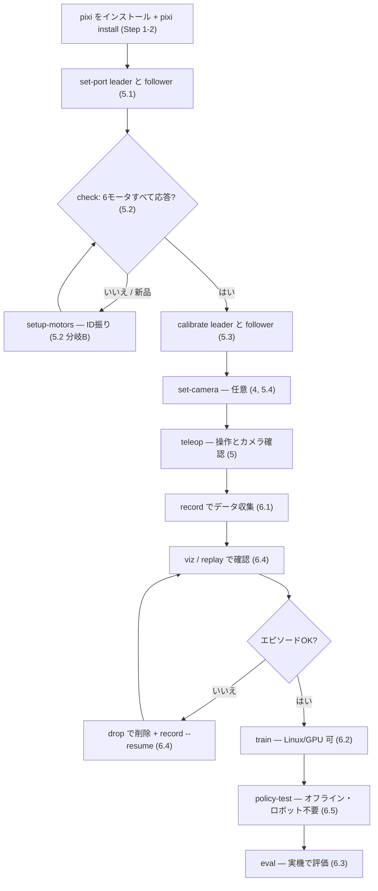

# lecture_lerobot_teleop

講義用の [LeRobot](https://github.com/huggingface/lerobot) テレオペレーション環境を、
[pixi](https://pixi.sh) で再現性高く構築するためのリポジトリです。

`pixi` は **conda-forge** と **PyPI** のパッケージを 1 つのロックファイルで解決するため、
macOS / Linux のどの環境でもコマンド 1 つで同一の環境が手に入ります。ここでは、LeRobot が
動画のエンコード／デコードに必要とするネイティブの **ffmpeg**（conda-forge 由来）と、
SO-100 / SO-101 のテレオペアームで使う Feetech サーボ SDK を含む
**`lerobot[feetech]`**（PyPI 由来）を一緒に入れるために pixi を使います。

🇬🇧 English version: [README.md](./README.md)

## 全体像 — どの順で進めるか



初回は **Step 1–3 を一度だけ**実施 → アームの立ち上げ（Step 5）を腕ごとに → 以降は
データ収集→学習→評価のループ（Step 6）。青いボックスは**ロボット不要**（リモート/Linux GPU で実行可）。

### いつ何を接続するか

| コマンド | 接続するもの | メモ |
| --- | --- | --- |
| `set-port leader` / `follower` | その**片方**のアームの USB | 検出のため「抜いて」と促されます。1本ずつ接続 |
| `setup-motors <role>` | アーム基板 + **モータ電源**、モータは**1個ずつ** | 画面の指示に従う |
| `check` / `calibrate <role>` | そのアームの USB **+ モータ電源** | |
| `teleop`, `record` | **両方**のアームの USB + **両方通電** + カメラ USB | leader=teleop, follower=robot |
| `eval`, `replay` | **follower** の USB + 電源（eval はカメラも） | leader 不要 — ポリシー/録画が follower を駆動 |
| `find-cameras`, `set-camera` | カメラの USB | index を調べて登録 |
| `train`, `policy-test`, `viz`, `upload` | **不要**（ロボット無し） | データ/計算のみ — SSH 先でOK |

> 電源 = サーボバスの電源（DC バレルジャック）。USB だけではモータは応答しません。自律 `eval` 時は
> 電源スイッチ／E-stop を手の届く所に（[安全](#安全-動きを緩やかにする止める)参照）。

## 含まれるもの

| パッケージ | バージョン | 取得元 | 用途 |
| --- | --- | --- | --- |
| `python` | `3.12.*` | conda-forge | lerobot 0.5.x が要求 |
| `ffmpeg` | `>=7.0,<8` | conda-forge | 動画エンコード・デコード。lerobot のデコーダ(`torchcodec`)は ffmpeg ≤ 7 対応 |
| `lerobot[feetech]` | `==0.5.1` | PyPI | LeRobot 本体 + Feetech モータ用 `feetech-servo-sdk` |

各ピン留めの理由は下の[なぜこのバージョン？](#なぜこのバージョン)を参照してください。

## 1. pixi をインストール（マシンごとに 1 回）

```bash
curl -fsSL https://pixi.sh/install.sh | bash
```

インストール後、`pixi` が `PATH` に乗るようにシェルを再起動（または rc ファイルを `source`）
してください。Windows は[公式インストールガイド](https://pixi.sh/latest/#installation)を参照。

> すでに pixi がある場合は、バージョンを確認しておくと安心です: `pixi --version`
> （pixi 0.61 で動作確認）

### Linux の要件

Linux では **glibc ≥ 2.31**（Ubuntu 20.04+ / Debian 11+）が必要です。LeRobot が依存する
`rerun-sdk` の wheel が `manylinux_2_31` 向けのためです。macOS（Apple Silicon）にこの制約はありません。

## 2. 環境を構築する

リポジトリのルートで実行します。

```bash
pixi install
```

`pixi.toml` を読み込み、依存関係をすべて解決して `pixi.lock` を生成／更新し、ローカルの
`.pixi/` フォルダにインストールします。初回は PyTorch などをダウンロードするため数分かかります。

## 3. 環境を使う

環境内でコマンドを 1 つ実行する場合:

```bash
pixi run python -c "import lerobot; print(lerobot.__version__)"
```

環境を有効化したシェルに入る場合:

```bash
pixi shell
python -c "import lerobot; print(lerobot.__version__)"
exit   # pixi shell を抜ける
```

### 定義済みタスク

```bash
pixi run verify          # lerobot と feetech SDK を import してバージョンを表示
pixi run ffmpeg-version  # pixi が入れた ffmpeg のバージョンを表示
pixi run find-cameras    # 接続中のカメラを列挙しサンプル画像を保存

# SO-101 アーム操作 — 役割ごとに一度登録すれば、以降 port/id は不要:
pixi run set-port leader      # リーダーのシリアルポート(と id)を検出して保存
pixi run set-port follower    # フォロワーも同様
pixi run arms                 # 登録済みのアームを表示
pixi run check follower       # 保存済みポートでモータ診断
pixi run setup-motors leader  # 保存済みポートでモータID振り
pixi run set-camera front --index 0  # フォロワーにカメラを付ける（5.4 参照）
pixi run calibrate leader     # 保存済み port/id でキャリブレーション
pixi run teleop               # 両アームでテレオペ（+ビューアにカメラ表示）— 引数不要!

# 模倣学習パイプライン（Step 6 参照）:
pixi run record --task "Grab the cube" --repo-id record-test --episodes 5
pixi run replay --repo-id record-test --episode 0   # 録画をフォロワーで再生
pixi run viz    --repo-id record-test --episode 0   # エピソードを Rerun ビューアで可視化
pixi run upload --repo-id record-test               # ローカルのデータセットを Hub へ
pixi run train  --repo-id record-test
pixi run eval   --policy outputs/train/act_record-test/checkpoints/last/pretrained_model \
                --task "Grab the cube" --repo-id eval_record-test
```

## 4. カメラの接続確認

LeRobot は `lerobot-find-cameras` を提供しており、開けるカメラを列挙して各カメラから
サンプル画像を保存します（デフォルト: `outputs/captured_images/`）。これでカメラが実際に
接続され読み取れているかを確認できます。

```bash
pixi run find-cameras            # 全バックエンドを試す（OpenCV + RealSense）
pixi run find-cameras opencv     # USB / 内蔵 Web カメラのみ（OpenCV）
pixi run find-cameras realsense  # Intel RealSense デプスカメラのみ
```

便利なオプション（コマンドの後ろに付与）:

```bash
pixi run find-cameras opencv --record-time-s 2 --output-dir outputs/cam_check
```

表示される一覧（index/path・解像度・FPS）で各カメラを特定し、保存された画像で映像を確認します。
何も表示されない場合は USB 接続と権限を見直してください。

> **macOS:** 初回実行時にカメラ権限のダイアログが出ます。ターミナルに対して許可してください
> （システム設定 → プライバシーとセキュリティ → カメラ）。許可後に再実行します。
> **Linux:** ビデオデバイスへのアクセス権が必要です。例:
> `sudo usermod -aG video $USER`（実行後に再ログイン）。

## 5. アームの立ち上げ（Feetech / SO-100・SO-101）

`scripts/so101.py`（pixi タスク化済み）を使うと、**役割ごとにアームを一度登録**するだけで、
以降のコマンドに port も id も書かずに済みます。保存先は `.so101_arms.json`（git 管理外・端末ローカル）。
新品アームの流れは **ポート登録 → モータID振り → キャリブレーション → テレオペ** です。

> デフォルトの type は `so101_leader` / `so101_follower`。SO-100 や Koch の場合は登録時に
> `--type` を渡します。例: `pixi run set-port leader --type so100_leader`。

### 5.1 各アームのポートを登録（一度だけ）

```bash
pixi run set-port leader      # プロンプトでリーダー基板「だけ」を抜いて Enter → 再接続
pixi run set-port follower    # フォロワーも同様
pixi run arms                 # 保存内容を確認
```

`set-port` は「USB を抜いた時に消えたポート」を検出するので、常に正しいポートを選びます。
キャリブレーション `id`（既定 `my_awesome_leader_arm` / `my_awesome_follower_arm`）も保存します。
自分で決めたい場合は `--id NAME` を渡してください。

### 5.2 モータID を振る — 必要な場合だけ

必要かどうかはアームの状態次第です。**まず `check` で状態を確認**します:

```bash
pixi run check follower    # leader も: pixi run check leader
```

出力に応じて分岐します:

#### 分岐A — ID が既に振られている（設定済みアーム、または以前に実施済み）

6 個すべてが正しい id の行を表示（`NO RESPONSE` 無し）。**setup-motors は不要**なので、
そのまま 5.3（キャリブレーション）へ進みます。

#### 分岐B — 新品/ほぼ初期状態（ID 未設定）

Feetech サーボは**全て同じ既定 id（1）**で出荷されるため、白紙のアームでは `check` がほぼ
`NO RESPONSE`（id 1 だけが応答、しばしば文字化け）になります。各モータへ id（1〜6）と
ボーレートを**一度だけ**書き込みます。モータを**1 個ずつ**接続するよう案内されます:

```bash
pixi run setup-motors follower
pixi run setup-motors leader
```

その後 `pixi run check <role>` を再実行 → 6 個すべて応答すればOK。

> **一部だけ（例: id 2 と 4）欠落し、他は正常な場合**は、白紙アームのケースでは**ありません**
> （id は存在するが応答していない）。ほぼ**そのモータへの配線または電源**が原因です（欠落モータの
> 両側コネクタを挿し直し、通電を確認）。あるいは未割り当てなら `setup-motors <role>` を再実行。
> 下の「Teleop error … no status packet」も参照。

### 5.3 確認・キャリブレーション・テレオペ

```bash
pixi run check follower    # 全モータが応答し範囲内か確認
pixi run calibrate follower
pixi run calibrate leader
pixi run teleop            # リーダーでフォロワーを操作 — port/id 不要
```

`check` は各モータの生位置・homing offset・応答有無を表示します。キャリブレーション前に、
応答しないモータや範囲外の関節を見つけるのに使ってください。

### 5.4 テレオペ中にカメラを見る

フォロワーにカメラを登録すると、`teleop` がそれを付与し、[Rerun](https://rerun.io) ビューアに
**カメラ映像と関節データ**を表示します。まず `pixi run find-cameras`（Step 4）で各カメラの index を
調べ、次のように登録します:

```bash
pixi run set-camera front --index 0                         # 既定 640x480@30
pixi run set-camera wrist --index 2 --width 1280 --height 720
pixi run arms                                               # 登録済みカメラを確認
pixi run teleop                                             # 自動でビューアが開く
```

`teleop` は `--display_data=true` と保存済みの `--robot.cameras=…` を自動で付けるので、ビューアに
カメラ画像が出ます。切り替え:

```bash
pixi run teleop --no-cameras   # アームのみ（カメラ取得なし）
pixi run teleop --no-display   # カメラは動かすがビューアは開かない
pixi run teleop --keep-viewer  # 実行終了後も Rerun ビューアを残す
pixi run set-camera front --remove   # カメラを外す
```

> lerobot は `rr.spawn()` で Rerun ビューアを起動し、終了処理をしないため、放っておくと実行後も
> ビューアが残ります。そこで `teleop` / `record` / `eval` は**この実行で起動したビューアを終了時に
> 閉じます**（閉じるのはそれだけ。既に開いていたビューアは触りません）。スクラブのため残したい場合は
> `--keep-viewer` を付けます。`viz` は閲覧が目的なので、意図的にビューアを残します。

その他のフラグは lerobot にそのまま渡されます（例: `pixi run teleop --fps=30`）。
公式ガイド: <https://huggingface.co/docs/lerobot>。

> Linux ではシリアルデバイスへのアクセス権が必要な場合があります。例:
> `sudo usermod -aG dialout $USER`（実行後に再ログイン）、または一時的に
> `sudo chmod 666 /dev/ttyACM0`。

#### テレオペエラー: `Failed to write 'Lock' on id_=N … There is no status packet!`

そのバス上のモータが応答していません。`pixi run check <role>` でどれか（`NO RESPONSE`）が分かります。
原因はほぼ、そのモータへの**デイジーチェーン配線または電源**、もしくは**ID 未割り当て**
（`pixi run setup-motors <role>` で再設定）です。ケーブルを挿し直し、通電を確認してから再試行します。

#### キャリブレーションエラー: `Magnitude <N> exceeds 2047`

キャリブレーションは各関節を中央化するため、Feetech の `Homing_Offset` レジスタに
`homing_offset = 現在位置 − 2047` を書き込みます。このレジスタは 11bit（±2047 が上限）です。
このエラーは、ENTER を押した瞬間にある関節の生位置が単回転の範囲（おおよそ `2047 + 2047 =
4094`）を超えていて、必要なオフセットが収まらなかったことを意味します。例えば `Magnitude 2448`
なら、その関節が上限を約 400 カウント（≈35°）はみ出しています。

次の順で対処します:

1. **原因の関節を特定して中央へ寄せる。** `pixi run check <role>` で `OUT OF RANGE` の関節が分かります。
   その関節を可動域の中央（`true_pos` が 0/4095 ではなく 2047 付近）へ動かし、再キャリブレーションします。
2. **電源を入れ直して setup をやり直す。** モータ電源と USB を抜き差しし、`pixi run setup-motors <role>`
   を再実行して、前回の残留 `Homing_Offset` をクリアします。
3. **ホーンを付け直す。** ある関節がどうしても中央に届かない場合、サーボホーン／ギアが中心からずれて
   組まれています。SO-101 の組立ガイドに従い、関節を中央にした状態で付け直してください。

## 6. 模倣学習: 記録 → 学習 → 評価

テレオペが動けば、データセット記録 → ポリシー学習 → 評価まで、保存済みのアーム／カメラを
再利用して **port も id も書かずに**実行できます。公式の
[模倣学習チュートリアル](https://huggingface.co/docs/lerobot/il_robots)に対応します。

### 6.1 データセットを記録

```bash
pixi run hf-login    # --push でアップロードする場合のみ必要
pixi run record --task "Grab the black cube" --repo-id record-test --episodes 5
```

- `--repo-id name` は `<HFユーザー or local>/name` として保存されます。明示するなら `user/name`。
  カメラと Rerun ビューアは自動で付きます。
- Hub へアップロードするには `--push`（事前に `pixi run hf-login`）。

**保存先と上書きについて。** データセットは**ローカル**の
`~/.cache/huggingface/lerobot/<repo_id>/` に書かれます（`--push` した時だけ Hub にも上がります）。
lerobot は既存データセットを上書きしません（`FileExistsError`）。取り直すには 3 通り:

```bash
pixi run record ... --repo-id record-test --overwrite        # 削除して新規作成
pixi run record ... --repo-id record-test --resume=true      # 追記（エピソード追加）
pixi run record ... --repo-id record-test-2                  # 別名にする
```

**開始/停止の操作。** 記録はボタンで開始/停止するのではなく、**自動で始まり**、各エピソードを一定時間
（既定 60 秒）記録し、その後リセット時間（既定 60 秒）を挟んで次へ進みます。流れは
**フォーカスしたターミナル**から矢印キーで操作します:

| キー | 動作 |
| --- | --- |
| **→ 右矢印** | 現在のエピソード（またはリセット時間）を早めに終えて次へ |
| **← 左矢印** | 現在のエピソードを破棄して**やり直し** |
| **Esc** | セッション全体を**停止**（その後エンコード・保存） |

キーを押す代わりに `--episode-time` / `--reset-time` で時間を指定できます:

```bash
pixi run record --task "Grab the cube" --repo-id record-test \
  --episodes 5 --episode-time 20 --reset-time 10
```

> **macOS:** キー監視（pynput）には権限が必要です。システム設定 → プライバシーとセキュリティ で
> ターミナルに **入力監視（Input Monitoring）** と **アクセシビリティ** を許可し、キー入力時は
> （Rerun ウィンドウではなく）ターミナルをフォーカスしてください。ヘッドレス/SSH ではキーボードが
> 使えないので、`--episode-time` / `--reset-time` と `--episodes` で制御します。

### 6.2 ポリシーを学習

```bash
pixi run train --repo-id record-test          # ACT、device は自動判定（mps/cuda/cpu）
```

- 既定: `--policy act`、`--job-name <policy>_<dataset>`、`--output-dir outputs/train/<job>`、
  Hub push なし、W&B なし。
- 学習量: `--steps N` で総学習ステップ数を指定します（例:
  `pixi run train --repo-id record-test --steps 20000`）。関連: `--batch-size`、
  `--save-freq`（N ステップごとにチェックポイント保存）。その他の lerobot フラグも素通しできます
  （例: `--log_freq=100 --eval_freq=0`）。
- オプション: `--policy diffusion|smolvla|…`、`--device cuda|mps|cpu`、`--wandb`、
  `--push-repo-id my_policy`。再開は
  `pixi run train --resume outputs/train/act_record-test/checkpoints/last`。
- ACT の学習は**数時間**かかります。`mps`（Apple Silicon）でも動きますが、CUDA GPU や
  Google Colab の方が大幅に速いです。チェックポイントは `outputs/train/<job>/checkpoints/` に出ます。

### 6.3 評価（学習済みポリシーを実行）

```bash
pixi run eval \
  --policy outputs/train/act_record-test/checkpoints/last/pretrained_model \
  --task "Grab the black cube" --repo-id eval_record-test --episodes 10
```

- ポリシーを**フォロワーのみ**で実行し（リーダー不要）、評価エピソードを記録します。データセット名は
  **`eval_` 始まりが必須**（lerobot の仕様）で、満たさないとツールが先回りでエラーにします。
- `--policy` はチェックポイントのディレクトリ（例: `…/checkpoints/last` や `…/checkpoints/001000`）でOK
  — ツールが `pretrained_model` サブフォルダを自動補完します — もしくは Hub のリポジトリ ID
  （例: `your-user/act_record-test`）。ローカルに無く `user/name` 形式でもないパスは、分かりやすい
  エラーで弾きます（タイポ対策）。

3 つとも追加の lerobot フラグをそのまま渡せます（例: `--dataset.episode_time_s=30`）。
`--no-cameras` / `--no-display` はテレオペと同じ挙動です。

### 6.4 録画の再生（replay）／データセットのアップロード

replay は録画済みエピソードのアクションを**フォロワー**で再生します。学習前のデータ確認に便利です:

```bash
pixi run replay --repo-id record-test --episode 0
```

viz はエピソード（カメラ画像・状態・アクション）を Rerun ビューアで可視化します。ロボット不要なので
どのマシンでもデータを確認できます:

```bash
pixi run viz --repo-id record-test --episode 0
```

`--push` なしで録ったデータセットを後から Hub に上げる（先に `pixi run hf-login`）:

```bash
pixi run upload --repo-id record-test            # → huggingface.co/datasets/<you>/record-test
pixi run upload --repo-id record-test --private --tags so101,demo
```

**データセットの選別: 確認 → 悪いエピソードを削除 → その分だけ撮り直し。**

```bash
pixi run viz --repo-id record-test --episode 0     # 各エピソードを確認（0,1,2,…）
pixi run drop --repo-id record-test --episodes 1,3 # 悪いものを削除（バックアップ自動作成）
pixi run record --task "Grab the black cube" --repo-id record-test \
  --resume --episodes 2                            # 代わりに 2 本を新規録画（追記）
```

注意（すべて実データで検証済み）:
- `drop` は in-place 編集で、データセットの隣にバックアップ（`<name>_old`）を残します。
  問題なければバックアップは削除して構いません。
- `drop` 後、残りのエピソードは **0 から振り直され**ます。再度 drop する前に `viz` で
  インデックスを確認してください。
- `--resume` 時の `--episodes N` は「**追加で N 本**」の意味です（`--overwrite` と `--resume` は
  同時指定不可）。

つまり全体の流れは **記録 → viz/replay(確認) → drop+撮り直し(選別) → upload(任意) → 学習 → 評価**
です。学習済みポリシーは `train --push-repo-id <name>` で push できます（既定はローカル保持）。

### 6.5 SSH 先の Linux で検証する — ロボット不要

ハードが要るステップ以外はヘッドレスで動くので、SSH 先の GPU マシンでリポジトリの検証と学習が
できます:

**1. データセットを送る（ラップトップで録画済みのもの）:**

```bash
# 方法 A — Hub 経由: ラップトップで
pixi run upload --repo-id record-test
# （Linux 側では train/policy-test が自動ダウンロード。private なら `pixi run hf-login`）

# 方法 B — 直接コピー（Hub アカウント不要）:
rsync -av ~/.cache/huggingface/lerobot/<user>/record-test/ \
  linux:~/.cache/huggingface/lerobot/<user>/record-test/
```

**2. Linux 側でセットアップとスモークテスト:**

```bash
git clone <this-repo> && cd lecture_lerobot_teleop
pixi install                       # linux-64 はロック済み
pixi run verify
pixi run python -c "import torch; print(torch.cuda.is_available())"
```

**3. 学習（まず短いスモーク → 本番）:**

```bash
pixi run train --repo-id record-test --steps 200 --save-freq 100   # スモーク
pixi run train --repo-id record-test --steps 20000 --device cuda
```

**4. ロボット無しの「評価」— オフライン推論テスト:**

```bash
pixi run policy-test --policy outputs/train/act_record-test/checkpoints/last \
  --repo-id record-test --device cuda
```

実機 `eval` と同一の推論パイプライン（ポリシーロード・前後処理・動画デコード・`predict_action`）を
録画フレームで回し、レイテンシ（Hz）と録画アクションとの平均乖離を表示します（このリポジトリの
実データで動作確認済み）。

**5. SSH 越しのデータ確認:** Rerun の記録ファイルを保存してローカルで見る:

```bash
# Linux 側
pixi run viz --repo-id record-test --episode 0 --save 1 --output-dir outputs/viz
# ラップトップ側
scp linux:~/lecture_lerobot_teleop/outputs/viz/*.rrd . && rerun *.rrd
```

**6. ポリシーを持ち帰る**: `outputs/train/...` を rsync で戻すか、`train --push-repo-id
act_record-test` で push して、ラップトップで `pixi run eval --policy <you>/act_record-test ...`。

実機ステップ（`teleop` / `record` / `eval` / `replay`）はハードのあるマシンが必要です。ヘッドレスでは
キーボード操作と Rerun ウィンドウも使えません（`--no-display` と `--episode-time` で代替）。

> **学習中の `Could not load libtorchcodec` / `GLIBCXX_3.4.29 not found`:**
> ホストのシステム `libstdc++` が古く、環境内の ffmpeg スタックと合わない状態です（pip 版 torch が
> システムの libstdc++ を先にロードするため）。`pixi.toml` で修正済み: linux-64 では環境内の新しい
> `libstdc++` を `LD_PRELOAD` するため、torchcodec がフルスピードで動きます。確認:
> `pixi run python -c "from torchcodec.decoders import VideoDecoder; print('ok')"`。
> 保険として、torchcodec がロードできない場合は `train`/`policy-test` が自動で `pyav` に
> フォールバックします（手動指定: `--dataset.video_backend=pyav`）。

> **リモートで `RepositoryNotFoundError … datasets/local/record-test`:**
> `--repo-id name`（名前のみ）には名前空間の解決が必要です。ツールは HF ログイン、未ログイン時は
> `~/.cache/huggingface/lerobot/<user>/name` にある既存ローカルデータセットから解決します。どちらも
> 無い場合は手順付きで先にエラーを出します。対処: 先にデータセットを rsync（上の方法 B）、フル ID を
> 渡す（`--repo-id <user>/record-test`）、または `pixi run hf-login`。

## 安全: 動きを緩やかにする・止める

**フォロワーを遅くする（急な同期を防ぐ）。** 既定ではフォロワーはリーダーの姿勢へ**全速**で動くため、
2 本の初期姿勢が離れていると勢いよくスナップします。`--max-rel`（**1 制御ステップで 1 関節が動ける
最大の度数**）で 1 ステップの移動量を制限すると、ゆっくりランプして急な大きい動きをしなくなります:

```bash
pixi run teleop --max-rel 5        # 目安 3〜8。小さいほど穏やかだが速い操作で遅延が出る
pixi run eval   --max-rel 5 ...    # 自律実行(eval)でも推奨
pixi run record --max-rel 5 ...
```

さらに、**開始前にリーダーをフォロワーの現在姿勢に近づけて**おくと初期のギャップが小さくなります。

**実行を止める。**

- **→** で現在のエピソードを終了、**Esc** でセッション全体を停止。停止時、lerobot は切断して
  **トルクを無効化＝アームは脱力**します。
- **Ctrl+C** でも同じ後始末（トルクOFF）が走るので、プログラムを落とせばアームは脱力します
  — ただし `kill -9` は例外（トルクが残り、最後の位置を保持）。
- ⚠️ トルクOFF は**持ち上がったアームが落下**することを意味します。手で支え、下を空けてください。
- （macOS: →/Esc キーは入力監視権限とターミナルのフォーカスが必要。記録と同じ → Step 6.1 参照）

**本当の緊急停止＝モータ電源を切る。** ソフト停止は瞬時ではなく、ハング時や `kill -9` ではトルクが
残ることがあります。自律実行(eval)では、サーボ電源（モータへの DC バレルジャック）に**インラインの
スイッチ／E-stop を入れて**即座に電源を切れるようにしてください。これが、慣れている E-stop ボタン
相当です。`--max-rel` と短い `--episode-time` を併用すると、暴れる範囲と時間を抑えられます。

## なぜこのバージョン？

LeRobot の依存関係は厳しめで、pixi は conda と PyPI を一緒に解決するため、両ソルバーの整合を
保つためにいくつかのピン留めをしています。

- **`python = 3.12.*`** — lerobot 0.5.x が Python ≥ 3.12 を要求。
- **`ffmpeg < 8`** — lerobot は `torchcodec` で動画をデコードし、これは ffmpeg 4〜7 にしか
  リンクできません。conda-forge の ffmpeg 8（`libavutil.60`）はロードに失敗するため 7.x に固定
  （`torchcodec` のデコーダ import を実機確認済み）。
- **`packaging < 26` と `setuptools >= 71, < 81`**（`[dependencies]` 内）— lerobot 0.5.1 が
  これらに上限を課す一方、conda-forge は新しい版を入れようとします。conda 側でピン留めすることで
  PyPI 側の解決が通ります。
- **glibc ≥ 2.31**（`[system-requirements]`）— Linux での `rerun-sdk` wheel に必要。これが無いと
  linux-64 の解決が壊れた placeholder 版 lerobot に静かにフォールバックするため、明示しています。

新しい lerobot に上げる場合は、`lerobot` を更新し、そのメタデータに対して
`python`/`packaging`/`setuptools`/`ffmpeg` の制約を見直してから `pixi install` を実行してください。

## Linux / Windows / Intel Mac で動かす

ロックファイルは現在 `osx-arm64` と `linux-64` をカバーしています。別プラットフォームに対応するには
追加して再ロックし、更新された `pixi.lock` をコミットします。

```bash
pixi project platform add win-64    # または: osx-64
pixi install
```

> ステータス: `linux-64` はここで解決を確認済み。以下は**ベストエフォートで、実際の Windows/Linux/
> Intel 実機では未検証**です。試すときに確認してください。解決が失敗するとエラーに原因パッケージ名が
> 出るので、それを共有してもらえればピンを調整します。

### Linux (x86_64) — 既にロック済み

- **glibc ≥ 2.31**（Ubuntu 20.04+ / Debian 11+）。`[system-requirements]` で設定済み。古いディストロでは
  別の `rerun-sdk` か、より低いピンが必要です。
- **シリアル権限:** `sudo usermod -aG dialout $USER`（再ログイン）。ポートは `/dev/ttyACM*` か `/dev/ttyUSB*`。
- **カメラ:** `sudo usermod -aG video $USER`。
- **record/eval のキー操作（→/Esc）** は pynput を使い、**X11 セッションが必要**です。Wayland のキー監視は
  不安定なので、「Xorg/X11」セッションでログインするか、`--episode-time` / `--reset-time` で制御します。
  ヘッドレス/SSH ではキーボードも Rerun ウィンドウも無い（`--no-display` を使う）。
- **動画/GPU:** torchcodec は linux-64 で動作。PyPI の `torch` は Linux では通常 CUDA ビルドなので、NVIDIA
  ドライバがあれば `pixi run train --device cuda` が使えます（`pixi run python -c "import torch; print(torch.cuda.is_available())"` で確認）。

### Windows (x86_64) — `win-64` を追加

- **シリアルポートは `COM3`, `COM4`, …** — `pixi run set-port` はそれも検出します（pyserial が `COM*` を
  同様に列挙）。`lerobot-*` は `--robot.port=COM5` を受け付けます。
- **torchcodec の Windows wheel が無い**ため、lerobot は動画デコードを**自動で `pyav` にフォールバック**します
  （動くが遅め）。録画は conda-forge の ffmpeg でエンコードします。*（ソースで確認: torchcodec が無いと pyav を使用）*
- **キー操作は動作**します（pynput は Windows 対応）。
- **GPU:** PyPI の `torch` は Windows では**既定が CPU 版**。CUDA は CUDA wheel（pixi の追加 index-url）が必要
  — もしくは Linux/Colab で学習。CPU 学習は可能ですが遅いです。
- `win-64` の解決自体は**未検証**です。`pixi install` を実行し、競合が出たら共有してください。

### Windows の WSL2 — 追加作業なし（WSL2 は linux-64 そのもの）

WSL2 は本物の linux-64 バイナリを実行するため、**既存のロックファイルがそのまま使えます** —
リモート Linux で動作実証済みのスタック（libstdc++ preload 修正込み）と同一です。WSL2 の
Ubuntu（22.04+ 推奨）内で、通常の Linux 手順（pixi インストール → `git clone` → `pixi install`）
を実行してください。

- **GPU:** CUDA は Windows 側の NVIDIA ドライバ経由で動きます — ドライバは *Windows にだけ*
  インストール（WSL 内に Linux ドライバを入れない）。`--device cuda` がそのまま使えます。
  確認: `pixi run python -c "import torch; print(torch.cuda.is_available())"`。
- **train / policy-test / viz:** 完全対応 — Windows マシンでこのリポジトリを使う場合、WSL2 が
  推奨ルートです。
- **ロボットのシリアル（teleop/record）:** WSL2 にネイティブの USB パススルーは無いため、
  [usbipd-win](https://github.com/dorssel/usbipd-win) でポートを転送します（PowerShell で
  `usbipd bind --busid <X-Y>` を管理者で一度、以降は挿し直すたび
  `usbipd attach --wsl --busid <X-Y>`）→ `/dev/ttyACM0` として見えます。新しめの標準 WSL2
  カーネルが必要。動きますが手間は増えます。
- **カメラ: 実質非対応。** 標準 WSL2 カーネルには UVC Web カメラドライバが無く、
  `find-cameras` は USB カメラを検出できません（回避はカーネル自前ビルドのみ）。カメラ付き
  録画はネイティブ Windows / macOS / Linux で行ってください。
- **ビューア/キー操作:** Windows 11 なら WSLg で Rerun ビューアが表示できます。それ以外は
  `--no-display` と `--episode-time` で。

**結論:** 計算系（train / policy-test / viz）は WSL2、ロボット系は USB に直接アクセスできる
マシンで、という分担が現実的です。

### Intel Mac (osx-64) — `osx-64` を追加

- 動画は Windows と同じく torchcodec が Intel macOS でも除外され、自動で `pyav` を使います。それ以外は
  Apple Silicon と同じ流れです。

### 共通

- `.so101_arms.json` は端末ローカル（シリアルポートを保存）なので、各受講者が自分の PC で `set-port` を
  実行します（git では共有されません）。
- プラットフォーム追加後は、**再生成された `pixi.lock` をコミット**して全員が同じマルチプラットフォーム環境を
  得られるようにします。

## 依存関係の更新

```bash
pixi update            # pixi.toml の制約内ですべて更新
pixi update lerobot    # 特定のパッケージだけ更新
```

再現性を保つため、`pixi.toml` と `pixi.lock` の両方をコミットしてください。

## トラブルシューティング

- **`pixi: command not found`** — pixi インストール後にシェルを再起動するか、`~/.pixi/bin` を
  `PATH` に追加してください。
- **解決／ダウンロードが遅い** — 初回は PyTorch（大きい）を取得します。2 回目以降はキャッシュを
  再利用します。キャッシュが壊れた場合は `pixi clean cache`。
- **実行時の `torchcodec`／動画エラー** — 必ず `pixi run` / `pixi shell` 経由で実行し、conda-forge の
  `ffmpeg 7.x` が `PATH` に来るようにしてください。システムの ffmpeg 8 は `torchcodec` が必要とする
  ライブラリ版を欠いています。
- **シリアルポートが見つからない** — `pixi run set-port <role>` を実行してください。USB を抜いた時に
  消えるデバイスでポートを特定します。ケーブルや権限も確認します。
- **`objc[...] Class AVFFrameReceiver is implemented in both … cv2 … and … av …`** — 無害です。
  OpenCV(`cv2`) と PyAV(`av`) がそれぞれ FFmpeg ライブラリを同梱しているため、macOS が重複を警告する
  だけで、上記のテレオペ失敗（モータ通信エラー）の原因ではありません。無視して構いません。

## リポジトリ構成

```
.
├── pixi.toml          # 環境定義（編集するのはこちら）
├── pixi.lock          # 全プラットフォーム向けの解決済みバージョン（編集せずコミット）
├── scripts/
│   └── so101.py       # アーム CLI: set-port/check/setup-motors/calibrate/teleop + record/replay/viz/upload/train/eval
├── .so101_arms.json   # 役割ごとの保存ポート（git 管理外・set-port で生成）
├── README.md          # 英語版
└── README_ja.md       # このファイル
```
